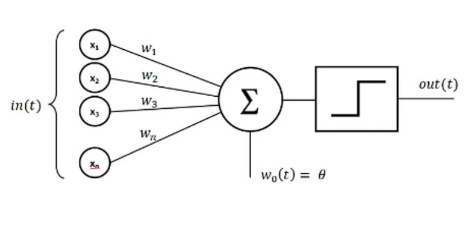

# Deep Neural Networks

### Perceptron
- We can say it is a single Neuron based Neural Network.
- A single-layer perceptron is the basic unit of a neural network. A perceptron consists of input values, weights and a bias, a weighted sum and activation function.

- It was later shown that the technology was only **linearly separable**, in other words, the perceptron was only able to work with linear separation of data points.
- **Source Artical:** [HERE](https://towardsdatascience.com/what-is-a-perceptron-basics-of-neural-networks-c4cfea20c590)

- **Little Demo on linear classification:** https://dhyanesh-panchal.github.io/perceptron-demonstartion.github.io/
- Little Discussion on XOR and the function of seprability : [HERE](https://stackoverflow.com/questions/9600888/single-perceptron-non-linear-evaluating-function)
