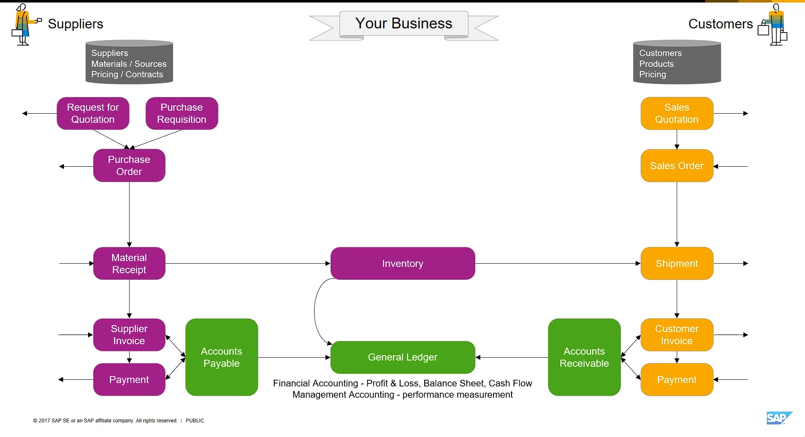

# CRM (customer relationship management)

- > **Source** :- <https://www.techtarget.com/searchcustomerexperience/definition/CRM-customer-relationship-management#:~:text=Customer%20relationship%20management%20(CRM)%20is,retention%20and%20drive%20sales%20growth>.
- Customer relationship management (CRM) is the combination of practices, strategies and technologies that companies use to manage and analyze customer interactions and data throughout the <a href="">customer lifecycle</a>.
- The goal is to improve customer service relationships and assist in customer retention and drive sales growth

> - At the most basic level, CRM software consolidates customer information and documents it into a single CRM database so business users can more easily access and manage it.
>
# ERP (Enterprise Resource Planning)

- Introduction to ERP:- https://youtu.be/Da1hUqzoiAo
### An ERP system typically consists of a centralized database that stores and manages data from different departments or functions such as finance, accounting, inventory management, human resources, manufacturing, sales, customer relationship management (CRM), and more.

## ERP for distributors:

## ERP for Manufacturors:

